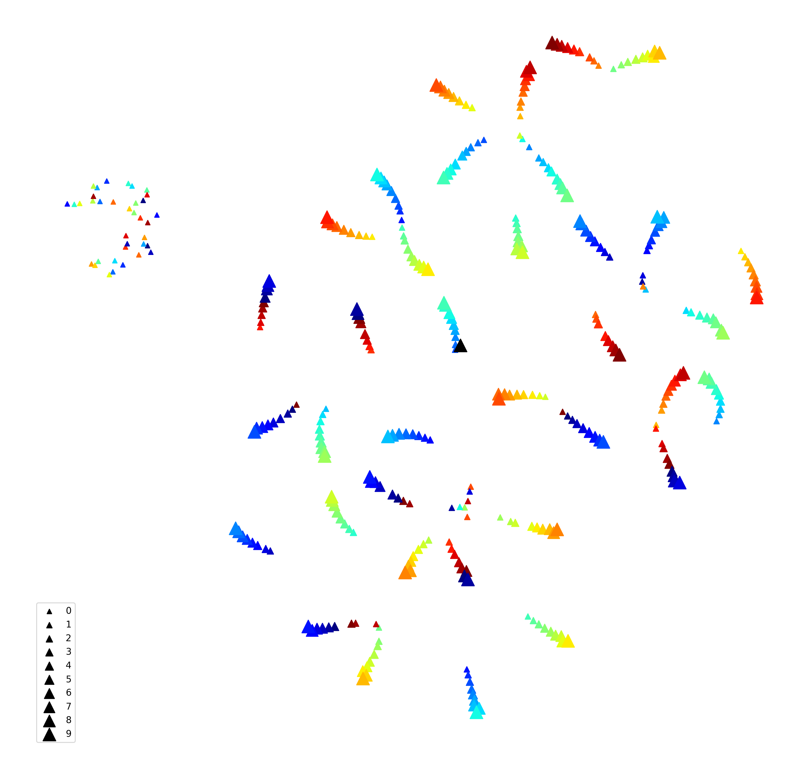
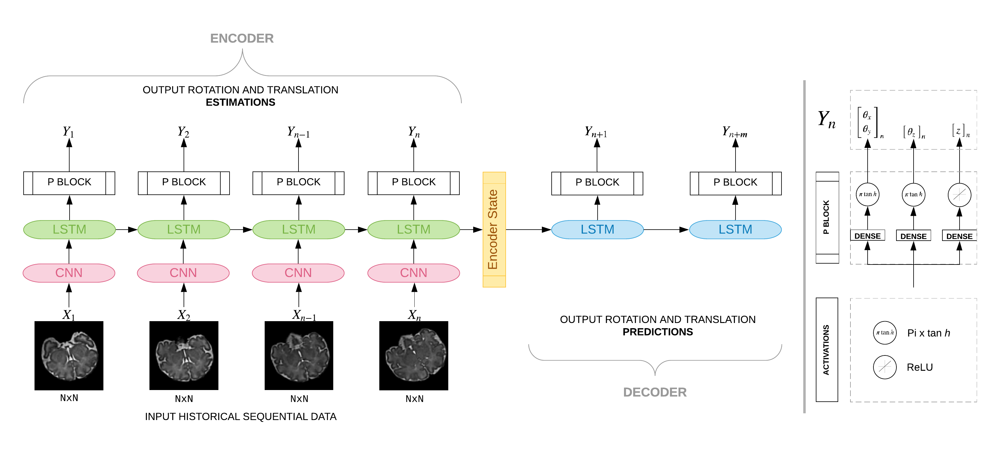
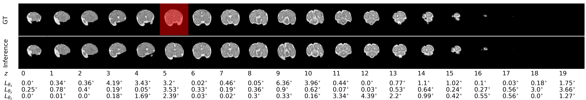

Code for [Deep Predictive Motion Tracking in Magnetic Resonance Imaging: Application to Fetal Imaging](https://arxiv.org/abs/1909.11625) to model robust spatiotemporal motion in fetal MRI

### Model Architecture

### Results

### Getting started
1. The `main.py` script runs all training and evaluation OR just evaluation using a pretrained model.
2. Simply configure the `sample.json` in experiments directory and pass it as an argument to he main script
> python main.py --config ./experiments/sample_experiment.json 
3. If step 2 is training then once the model is trained, the results of held out test set, a copy of experiments
.json and model itself will be persisted to given directory.
4. An example of how to configure experiments is put in ./experiments directory.
5. If a pretrained model path is provided then only evaluation will be done otherwise training.

